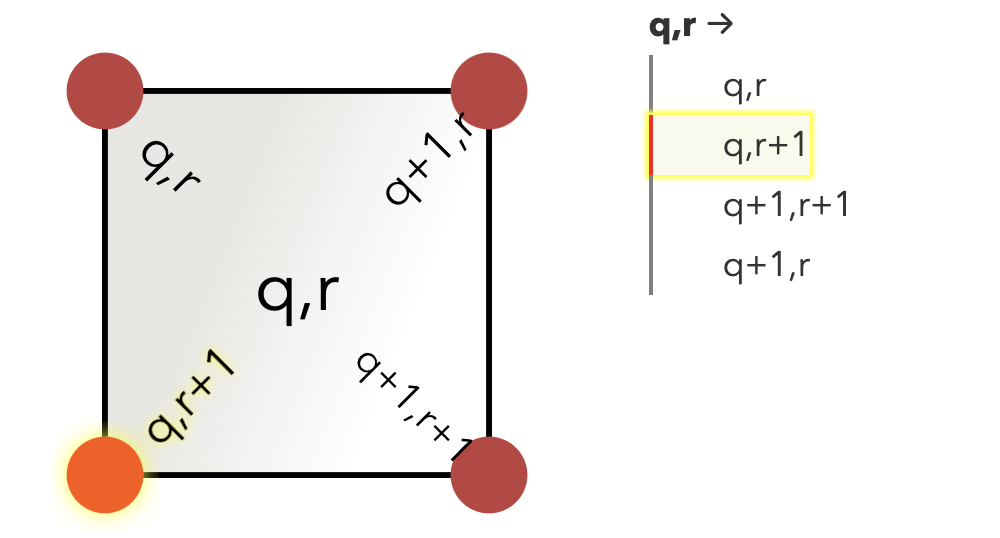
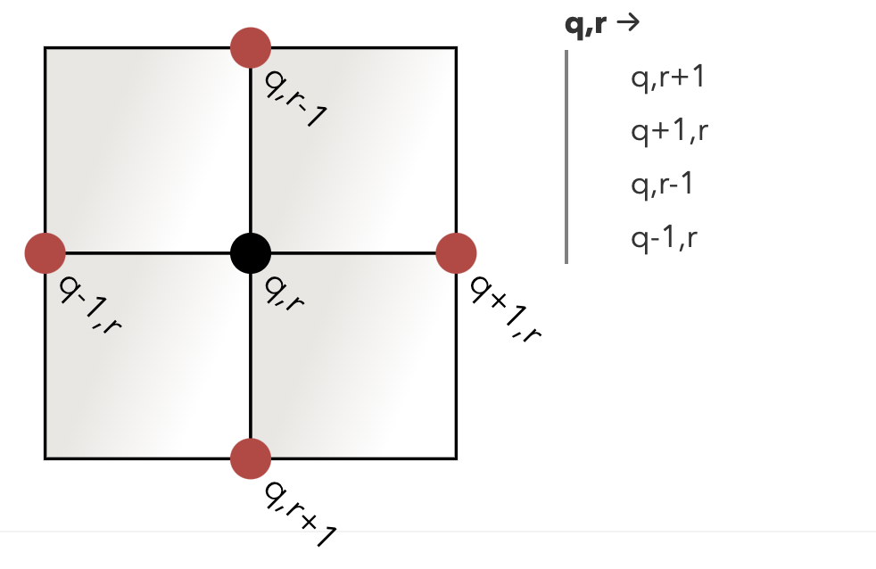

## part II

```
AAAA
BBCD
BBCC
EEEC
```

[(0,0), (1,0), (2,0), (3,0)] A -> 4

[(0, 1), (1,1), (0, 2), (1, 2)] B -> 4

[(2, 1), (2, 2), (3, 2), (3, 3)] C -> 8

## corners

◰ 1 side is corner

◱
◰ 2 adjacent sides is not a corner

◲◱
◰ 3 adjacent sides is a corner

◲◱
◳◰ 4 adjacent sides is not a corner

◲
◰ 2 non adjacent sides is two corners (separated regions)





<!-- images from  https://www.redblobgames.com/grids/parts/ -->

- to find corners (+-.5, +-.5) is less than a step ⛝, center to corner distance
