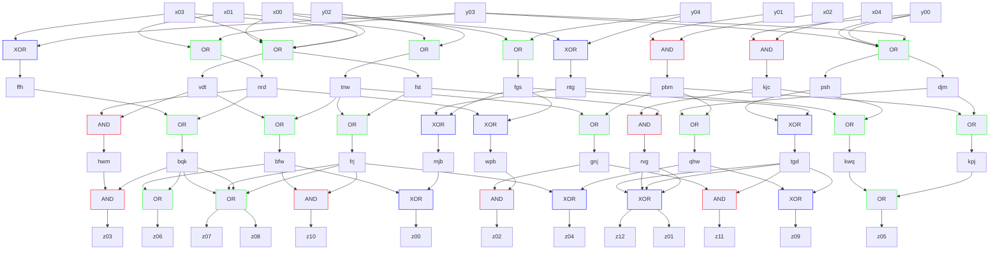

```mermaid
---
wire map
---
flowchart TD
x00 --> op_x00_x03[OR]
x03 --> op_x00_x03
op_x00_x03:::OR --> fst
x00 --> op_x00_y04[XOR]
y04 --> op_x00_y04
op_x00_y04:::XOR --> ntg
x00 --> op_x00_x03[OR]
x03 --> op_x00_x03
op_x00_x03:::OR --> vdt
x03 --> op_x03_y03[XOR]
y03 --> op_x03_y03
op_x03_y03:::XOR --> ffh
y00 --> op_y00_x04[AND]
x04 --> op_y00_x04
op_y00_x04:::AND --> kjc
y00 --> op_y00_y03[AND]
y03 --> op_y00_y03
op_y00_y03:::AND --> djm
y01 --> op_y01_x02[AND]
x02 --> op_y01_x02
op_y01_x02:::AND --> pbm
x01 --> op_x01_y02[OR]
y02 --> op_x01_y02
op_x01_y02:::OR --> tnw
y00 --> op_y00_y03[OR]
y03 --> op_y00_y03
op_y00_y03:::OR --> psh
x01 --> op_x01_y03[OR]
y03 --> op_x01_y03
op_x01_y03:::OR --> nrd
y02 --> op_y02_y04[OR]
y04 --> op_y02_y04
op_y02_y04:::OR --> fgs
ntg --> op_ntg_fgs[XOR]
fgs --> op_ntg_fgs
op_ntg_fgs:::XOR --> mjb
kwq --> op_kwq_kpj[OR]
kpj --> op_kwq_kpj
op_kwq_kpj:::OR --> z05
tgd --> op_tgd_rvg[XOR]
rvg --> op_tgd_rvg
op_tgd_rvg:::XOR --> z01
tgd --> op_tgd_rvg[XOR]
rvg --> op_tgd_rvg
op_tgd_rvg:::XOR --> z12
vdt --> op_vdt_tnw[OR]
tnw --> op_vdt_tnw
op_vdt_tnw:::OR --> bfw
bfw --> op_bfw_frj[AND]
frj --> op_bfw_frj
op_bfw_frj:::AND --> z10
ffh --> op_ffh_nrd[OR]
nrd --> op_ffh_nrd
op_ffh_nrd:::OR --> bqk
bqk --> op_bqk_frj[OR]
frj --> op_bqk_frj
op_bqk_frj:::OR --> z08
bqk --> op_bqk_frj[OR]
frj --> op_bqk_frj
op_bqk_frj:::OR --> z07
tnw --> op_tnw_fst[OR]
fst --> op_tnw_fst
op_tnw_fst:::OR --> frj
gnj --> op_gnj_tgd[AND]
tgd --> op_gnj_tgd
op_gnj_tgd:::AND --> z11
bfw --> op_bfw_mjb[XOR]
mjb --> op_bfw_mjb
op_bfw_mjb:::XOR --> z00
gnj --> op_gnj_wpb[AND]
wpb --> op_gnj_wpb
op_gnj_wpb:::AND --> z02
djm --> op_djm_pbm[OR]
pbm --> op_djm_pbm
op_djm_pbm:::OR --> qhw
nrd --> op_nrd_vdt[AND]
vdt --> op_nrd_vdt
op_nrd_vdt:::AND --> hwm
kjc --> op_kjc_fst[AND]
fst --> op_kjc_fst
op_kjc_fst:::AND --> rvg
ntg --> op_ntg_kjc[OR]
kjc --> op_ntg_kjc
op_ntg_kjc:::OR --> kwq
psh --> op_psh_fgs[XOR]
fgs --> op_psh_fgs
op_psh_fgs:::XOR --> tgd
qhw --> op_qhw_tgd[XOR]
tgd --> op_qhw_tgd
op_qhw_tgd:::XOR --> z09
pbm --> op_pbm_djm[OR]
djm --> op_pbm_djm
op_pbm_djm:::OR --> kpj
bfw --> op_bfw_bqk[OR]
bqk --> op_bfw_bqk
op_bfw_bqk:::OR --> z06
nrd --> op_nrd_fgs[XOR]
fgs --> op_nrd_fgs
op_nrd_fgs:::XOR --> wpb
frj --> op_frj_qhw[XOR]
qhw --> op_frj_qhw
op_frj_qhw:::XOR --> z04
hwm --> op_hwm_bqk[AND]
bqk --> op_hwm_bqk
op_hwm_bqk:::AND --> z03
tnw --> op_tnw_pbm[OR]
pbm --> op_tnw_pbm
op_tnw_pbm:::OR --> gnj
classDef AND stroke:#f00
classDef OR stroke:#0f0
classDef XOR stroke:#00f
```
